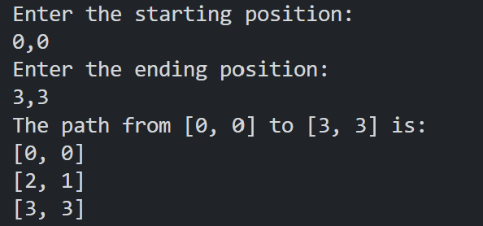

<h1 align="center">Ruby Knights Travails</h1>

This is an implementation of the BFS algorithm in Ruby to efficiently find the shortest path, following the knight's distinct L-shaped moves on a chessboard. This project was undertaken for studying purposes

---
</img>

### Tools

The following tools have been used in the project:

- [Ruby](https://www.ruby-lang.org/pt/)
- [VS Code](https://code.visualstudio.com)
---

### Author
Made by Johan Stromberg :fire:

---

<h4 align="center">
  🚧  Work In Progress...  🚧
</h4>